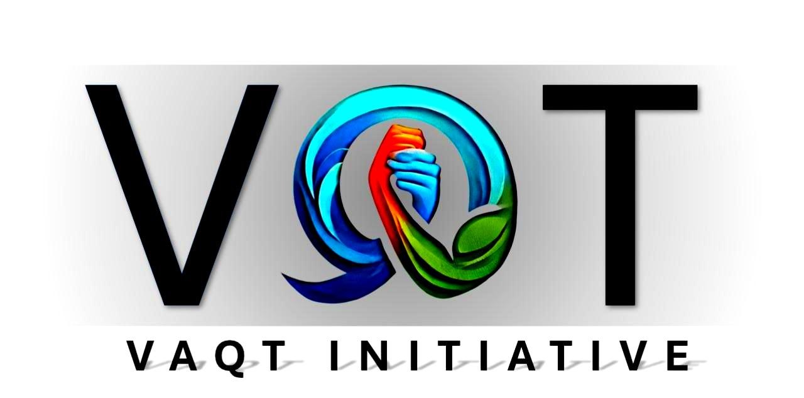

<!DOCTYPE html>
<html lang="en">
    <head>
        <meta charset="UTF-8">
        <meta name="viewport" content="width=device-width, initial-scale=1.0">
        <title>VAQT Initiative</title>
        <!-- Bootstrap CSS -->
        <link href="https://cdn.jsdelivr.net/npm/bootstrap@5.3.0-alpha3/dist/css/bootstrap.min.css" rel="stylesheet">
        
    </head>
    <body>
        <!-- Header Section -->
        <header class="container text-center py-3">
            
        </header>
        <!-- Navbar -->
        <nav class="navbar navbar-expand-lg navbar-dark bg-dark sticky-top">
            

                
                <button class="navbar-toggler" type="button" data-bs-toggle="collapse" data-bs-target="#navbarNav" aria-controls="navbarNav" aria-expanded="false" aria-label="Toggle navigation">
                
                </button>
                

                    <ul class="navbar-nav mx-auto">
                        <li class="nav-item"><a class="nav-link" href="#">Home</a></li>
                        <li class="nav-item"><a class="nav-link" href="#">About</a></li>
                        <li class="nav-item"><a class="nav-link" href="#">Values</a></li>
                        <li class="nav-item"><a class="nav-link" href="#">Heros4u</a></li>
                        <li class="nav-item"><a class="nav-link" href="#">Chotu</a></li>
                        <li class="nav-item"><a class="nav-link" href="#footerbyme">Contact</a></li>
                        <li class="nav-item"><a class="nav-link" href="#">Memory Gallery</a></li>
                    </ul>
                

            

        </nav>
        <!-- Card Section -->
        

            

                

                    

                        

                            

                                <h4 style="font-family: serif; font-weight: bolder; font-size: 50px;">Vision</h4>
                            

                            

                                
To revolutionize the concept of charity by leveraging skills and technology, where every second of effort creates a ripple of transformation, driven by creativity, empowerment, and transparency.

                            

                        

                    

                

                

                    

                        

                            

                                <h4 style="font-family: serif; font-weight: bolder; font-size: 50px;">Mission</h4>
                            

                            

                                
To foster a culture of giving by integrating modern technology into charitable efforts and turning abilities and resources into tools for change that empower all sections of society.

                            

                        

                    

                

                

                    

                        

                            

                                <h4 style="font-family: serif; font-weight: bolder; font-size: 50px;">Values</h4>
                            

                            

                                
We boldly address challenges by adapting swiftly to societal needs and building trust through upholding the highest standards with honesty and openness.

                            

                        

                    

                

            

        

        <!-- Video Section -->
        

            <h2>Our Story</h2>
            <video controls class="w-100" style="max-width: 800px;">
                <source src="video.mp4" type="video/mp4">
                Your browser does not support the video tag.
            </video>
        

        <!--Message space-->
        

            <b> NGO has various verticles broadly it will work on skill and time donation and not money donation  
            To illustrate- Suppose a person knows some skill he will register himself as a volunter he can either teach others who are underprivileged his skills or he can work on various company assignments and the money recieved against his work will directly be given to our NGO partners based on his preferences of donation.
            Suppose Ram did a CSS project of a company OM if OM pays money that amount will be donated to a NGO partner preferred by Ram and Ram will recieve impact points. If company OM doesn't give money but gives books under Company CSR that books will be directly donated to an NGO partner.
            The other vertical focuses on goods donation so second hand goods at half price will be sold after repackaging on our website and then the revenue earned will be donated through NGO partners after deducting operational expenses. 
            The final vertical is where various NGOs across india which are genuine will be partnered up and a centralized platform of NGOs will be formed so as to have a cross functionality and utilisation of NGO network.
             
            Vision is to create a model based on self financing NGO and it doesnt take donations generally however if somebody donates money the same can be utilised by sharing a trail of money used to donor.
            This NGO will be worlds most Advanced NGO that uses AI and buisness acumen to generate funds,
            which benefits every section of society.
            The NGO is based on a tagline that says making an impact creating memories which highlights the importance of one individual in this universe, and denotes that we are living a life to make an impact and by making an impact we will have a memory which will be cherished for a lifetime.
             The NGO will run mainly through a website 
            The name of NGO is VAQT that denotes importance of time/effort donation 
            The symbol of VAQT denotes that in long term no matter how strong aggressiveness is, a person with a calm mind wins....
            </b>
        

        <!-- Footer Section -->
        <
        <footer style="background-color: #132463;" id="footerbyme">
            <h4 style="font-family: none;
                font-size: xx-large;">Contact</h4>
            <ol style="list-style-type: none;margin: 40px 10px 50px 10px;font-family: cursive;font-style: italic;font-size: large;">
                <li style="
                    margin: 10px;
                    ">Email:  <a href="mailto:Vaqt.initiative@gmail.com" style="color:white">Vaqt.initiative@gmail.com</a> </li>
                <li style="
                    margin: 10px;
                    ">LinkedIn:  <a href="https://www.linkedin.com/in/ca-taha-merchant" style="color:white">linkedin.com/in/ca-taha-merchant</a></li>
                <li style="
                    margin: 10px;
                    ">Contact phone: +918698332852</li>
            </ol>
            
© 2024 VAQT Initiative. All Rights Reserved.

        </footer>
        <!-- Bootstrap JS -->
        
    </body>
</html>
